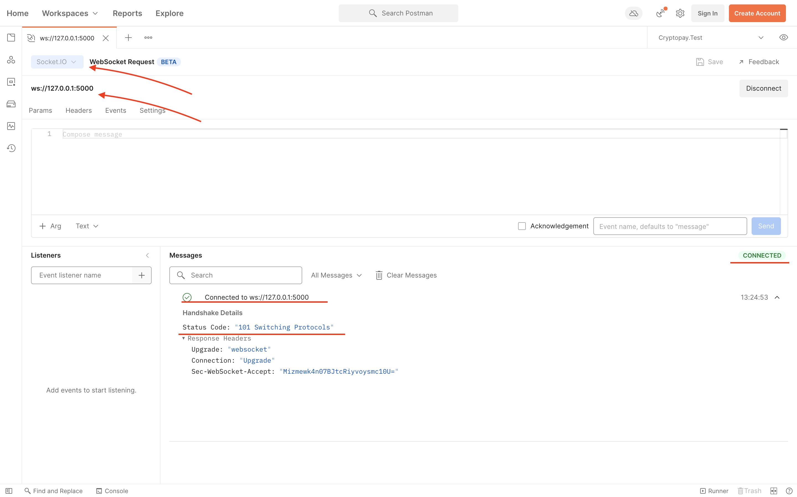

# How To

1. Run the app
    ```shell
    npm install
    node app.js
    ```
1. See results in app log:
    ```
    Server started on port 5000
    ```
1. Open http://127.0.0.1:5000/
1. See results in app log:
    ```
    Server started on port 5000
    A new socket has joined: IqEjjc0dBHYSHqpMAAAB
    ```

## Notes

### Using Postman to test SocketIO backend

According to [Postman Now Supports Socket.IO](https://blog.postman.com/postman-now-supports-socket-io/) you may use Postman as client for the demo

0. Install Postman Version 8.10.0+
1. In the left-hand sidebar, click New.
2. Select WebSocket Request.
3. Within the new tab’s header, click the drop-down that says Raw, and select Socket.IO instead.
4. Type the address of your Socket.IO server into the URL bar.
5. Click Connect.

Finally you should see something like that:

